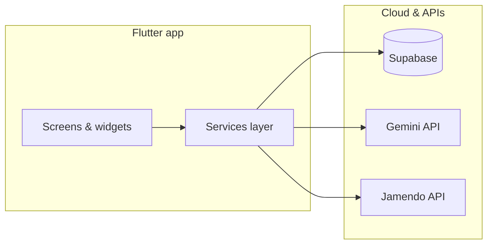

# Examination Stress Recovery Mobile Application

A cross-platform **Flutter** wellbeing app for university and Advanced Level (A/L) students managing **examination-related stress**. It combines mood tracking, productivity tools, relaxation exercises, AI-assisted guidance, anonymous peer support, and Sri Lanka–focused emergency signposting in one student-centred experience.

> **Important:** This app supports stress management and healthy study habits. It does **not** replace professional medical or psychological care.

<p align="center">
  
</p>

---

## Features

| Area | What you get |
|------|----------------|
| **Mood check-in** | Three-step daily flow: mood → sleep → goals → personalised summary |
| **AI support** | Google Gemini–powered chat, recovery tips, and daily challenges |
| **Focus & calm** | Pomodoro-style focus timer with session logging; guided breathing exercises |
| **Music** | Mood-based track discovery and streaming via [Jamendo](https://www.jamendo.com/) |
| **Community** | Anonymous emotion board with posts, replies, and social notifications |
| **Planning** | Calendar and examination event management |
| **Reminders** | Configurable local notifications (study, mood, social) |
| **Wellbeing extras** | Saved motivations, searchable help centre, privacy information, SOS resources |
| **Account** | Supabase authentication (sign up, login, password reset, profile avatars) |

**Main navigation:** Home · AI Chat · Recovery Tips · Profile — with deep links from notification taps into emotion-board threads.

---

## Tech stack

| Layer | Technology |
|-------|------------|
| **Client** | [Flutter](https://flutter.dev/) (Dart SDK ^3.8.1) |
| **Backend** | [Supabase](https://supabase.com/) (Auth, Postgres, RLS, Storage) |
| **AI** | [Google Gemini](https://ai.google.dev/) API |
| **Music** | [Jamendo](https://developer.jamendo.com/v3.0) API |
| **Local** | `shared_preferences`, `flutter_local_notifications`, `just_audio` |
| **CI** | GitHub Actions — `flutter analyze` + `flutter test` |

---

## Prerequisites

**To run the app**

- Flutter stable channel (Dart ^3.8.1)
- Android Studio and/or Xcode (for iOS on macOS)
- A configured Supabase project
- API keys for Google Gemini and Jamendo

**Target platforms:** Android (API 21+) and iOS (13.0+). An active internet connection is required for auth, sync, AI, music, and community features.

---

## Getting started

### 1. Clone and install dependencies

```bash
git clone <repository-url>
cd "Examination Stress Recovery App"
flutter pub get
```

### 2. Environment variables

Create a `.env` file in the project root (it is listed in `pubspec.yaml` assets and loaded at startup):

```env
SUPABASE_URL=https://your-project.supabase.co
SUPABASE_ANON_KEY=your-anon-key
GEMINI_API_KEY=your-gemini-api-key
JAMENDO_CLIENT_ID=your-jamendo-client-id
```

Never commit real API keys or the `.env` file to version control.

### 3. Supabase database

Apply the SQL migrations in `supabase/migrations/` to your Supabase project (via the SQL editor or Supabase CLI), in timestamp order. These define tables and policies for chat, emotion board, notifications, saved motivations, avatars, and related features.

### 4. Run the app

```bash
# List devices
flutter devices

# Run on a connected device or emulator
flutter run
```

For release builds:

```bash
flutter build apk
flutter build ios   # macOS + Xcode required
```

### 5. App icon (optional)

Launcher icons are generated from `assets/AppLogo.png`:

```bash
dart run flutter_launcher_icons
```

---

## Testing

```bash
flutter analyze
flutter test
```

Unit tests cover models, services (mood music queries, reminders, event parsing), notification payload parsing, and utilities under `test/`. CI runs the same checks on push/PR to `main` or `master` (see `.github/workflows/ci.yml`).

---

## Project structure

```
lib/
├── main.dart                 # App entry, Supabase + env init
├── homepage.dart             # Home hub and feature shortcuts
├── *_screen.dart             # Feature screens (mood, chat, board, etc.)
├── services/                 # API clients, auth, reminders, mood log
├── models/                   # Data models
├── widgets/                  # Shared UI (bottom nav, avatars, player)
└── utils/                    # Helpers

supabase/migrations/          # Database schema and RLS
test/                         # Unit tests
assets/                       # Images and branding
docs/                         # Report, user guide, IA diagrams, test cases
```

For screen flows and navigation, see [Information architecture & activity flows](docs/app-information-architecture-and-activity-flows.md).

---

## Documentation

| Document | Description |
|----------|-------------|
| [Appendix A — User Guide](docs/appendix-a-user-guide.md) | Install, demo, and feature walkthrough |
| [Information architecture](docs/app-information-architecture-and-activity-flows.md) | Screens, bottom nav, and Mermaid flow diagrams |
| [Functional test cases](docs/functional-evaluation-test-cases.md) | Manual evaluation scenarios |
| [Final project report](docs/final-report-final.md) | Full academic report (design, implementation, evaluation) |

---

## Architecture overview



Authentication uses Supabase with **PKCE**. Sensitive keys stay in `.env` on the device; data access is enforced with **Row Level Security** on the database.

---

## Academic context

**Module:** PUSL3190 Computing Project  
**Degree:** BSc (Hons) Software Engineering  
**Author:** Gunasinghe De Silva (Plymouth Index: 10953067)  
**Supervisor:** Ms. Dulanjali Wijesekara  

---

## License

This repository is part of a final-year computing project. Unless a separate license file is added, all rights are reserved by the author. Contact the author before redistribution or commercial use.
