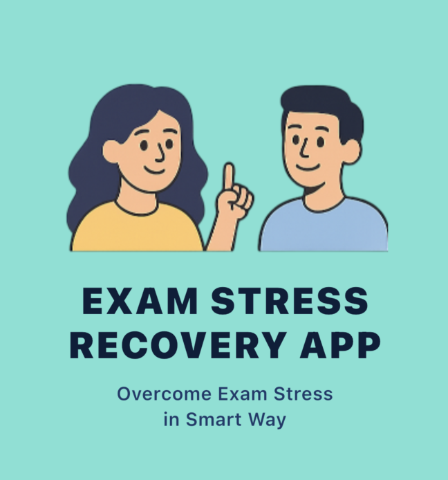
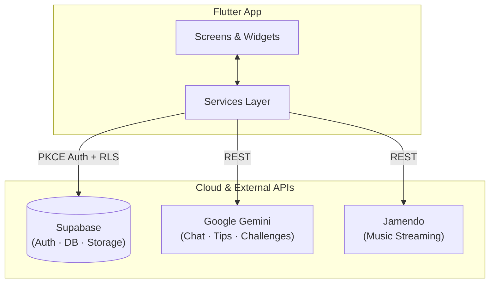

<div align="center">



# Examination Stress Recovery App

**A Flutter wellbeing companion for students navigating examination pressure**


> **Disclaimer:** This application supports healthy study habits and stress management strategies.  
> It is **not** a substitute for professional medical or psychological care.

</div>

---

## Overview

The **Examination Stress Recovery App** is a cross-platform mobile application designed for university and Advanced Level (A/L) students experiencing examination-related stress. It integrates emotional monitoring, AI-powered guidance, productivity tools, relaxation techniques, and anonymous peer support into a single student-centred experience — backed by [Supabase](https://supabase.com/) and powered by [Google Gemini](https://ai.google.dev/).

---

## Features

### Emotional Wellbeing
| Feature | Description |
|---------|-------------|
| **Daily Mood Check-in** | Three-step flow: mood selection → sleep hours → goals → AI-personalised summary |
| **Emotion Board** | Community space for sharing feelings and replying to peers — posts can be published under your profile or anonymously |
| **Saved Motivations** | Bookmark inspiring quotes and messages for later |

### AI-Powered Support
| Feature | Description |
|---------|-------------|
| **Gemini AI Chat** | Multi-thread conversational AI for exam stress and study advice |
| **Recovery Tips** | AI-generated, personalised wellbeing tips based on your mood |
| **Daily Challenges** | Mood-adaptive challenges to build healthier study habits |

### Productivity & Focus
| Feature | Description |
|---------|-------------|
| **Focus Timer** | Pomodoro-style timer with session history and break reminders |
| **Breathing Exercises** | Guided breathing animations for instant calm |
| **Calendar** | Examination event management with date reminders |

### Discovery & Safety
| Feature | Description |
|---------|-------------|
| **Music Recommendations** | Mood-matched music streaming via [Jamendo](https://www.jamendo.com/) |
| **SOS Resources** | Sri Lanka–focused emergency mental health contacts and hotlines |
| **Help Centre** | Searchable in-app guide and privacy information |

### Account & Notifications
| Feature | Description |
|---------|-------------|
| **Authentication** | Supabase PKCE-based sign-up, login, and password reset |
| **Profile** | Avatar presets, display name, and settings |
| **Local Reminders** | Configurable notifications for mood check-ins, study sessions, and social updates |

**Main navigation:** Home · AI Chat · Recovery Tips · Profile — with deep-link routing from notification taps directly into emotion-board threads.

---

## Tech Stack

```
┌─────────────────────────────────────────────────────┐
│                  Flutter (Dart ^3.8.1)              │
│              Android 5.0+  ·  iOS 13.0+             │
└───────────────┬─────────────────────────────────────┘
                │
     ┌──────────▼──────────┐
     │ Services Layer       │
     │  · Supabase          │  Auth, Postgres DB, RLS, Storage
     │  · Google Gemini     │  Chat, Tips, Challenges
     │  · Jamendo API       │  Mood-based music
     │  · Local stack       │  Notifications, Audio, Preferences
     └─────────────────────┘
```

| Layer | Technology |
|-------|------------|
| UI Framework | [Flutter](https://flutter.dev/) stable |
| Language | Dart ^3.8.1 |
| Backend & Auth | [Supabase](https://supabase.com/) (Postgres + RLS + Storage) |
| AI | [Google Gemini](https://ai.google.dev/) API |
| Music | [Jamendo](https://developer.jamendo.com/v3.0) API |
| Notifications | `flutter_local_notifications` + `timezone` |
| Audio | `just_audio` |
| Deep links | `app_links` |
| CI | GitHub Actions — analyze + test on every push/PR |

---

## Getting Started

### Prerequisites

- **Flutter SDK** — stable channel, Dart ^3.8.1
- **Android toolchain** — Android Studio, SDK, emulator or physical device (API 21+)
- **iOS toolchain** *(macOS only)* — Xcode 14+, CocoaPods, Simulator or device (iOS 13+)
- **Supabase project** — URL and anonymous key
- **API keys** — Google Gemini, Jamendo Client ID

### 1 · Clone the repo

```bash
git clone <repository-url>
cd "Examination Stress Recovery App"
```

### 2 · Install dependencies

```bash
flutter pub get
```

### 3 · Configure environment

Create a `.env` file in the **project root** (already declared as an asset in `pubspec.yaml`):

```env
SUPABASE_URL=https://your-project.supabase.co
SUPABASE_ANON_KEY=your-supabase-anon-key
GEMINI_API_KEY=your-google-gemini-api-key
JAMENDO_CLIENT_ID=your-jamendo-client-id
```

> Never commit your real `.env` to version control.

### 4 · Apply database migrations

Run the SQL files inside `supabase/migrations/` against your Supabase project (use the SQL Editor or the Supabase CLI), in ascending timestamp order. They create tables and Row Level Security policies for chat, emotion board, social notifications, saved motivations, and avatars.

### 5 · Run the app

```bash
flutter devices          # list connected devices / emulators
flutter run              # launch in debug mode
```

### 6 · Build for release

```bash
flutter build apk              # Android APK
flutter build appbundle        # Android App Bundle (Play Store)
flutter build ios              # iOS (macOS + Xcode required)
```

### Optional · Regenerate app icons

```bash
dart run flutter_launcher_icons
```

---

## Project Structure

```
.
├── lib/
│   │
│   ├── main.dart                            # App entry — env, Supabase, timezone, reminders init
│   ├── app_navigator.dart                   # Global navigator key + deep-link routing
│   ├── notification_payload_handler.dart    # Parse & dispatch notification payloads
│   ├── mood_flow_theme.dart                 # Shared colours & styles for mood flow
│   ├── profile_avatar_presets.dart          # Avatar preset definitions
│   │
│   ├── ── Entry & Auth ──
│   ├── splash_screen.dart                   # Animated splash → onboarding or home
│   ├── onboarding_screen.dart               # Onboarding step 1
│   ├── onboarding_screen_2.dart             # Onboarding step 2
│   ├── onboarding_screen_3.dart             # Onboarding step 3 → sign-up prompt
│   ├── signup_screen.dart                   # Account registration
│   ├── login_screen.dart                    # Email/password login
│   ├── forgot_password_screen.dart          # Password reset flow
│   │
│   ├── ── Main Tabs ──
│   ├── homepage.dart                        # Home hub — dashboard & feature shortcuts
│   ├── chat_screen.dart                     # Multi-thread Gemini AI chat
│   ├── recovery_tips_screen.dart            # AI-generated mood-matched tips
│   ├── profile_screen.dart                  # User profile, stats, and settings links
│   │
│   ├── ── Mood Flow ──
│   ├── mood_log_screen.dart                 # Step 1 — mood selection
│   ├── sleep_hours_screen.dart              # Step 2 — sleep hours input
│   ├── goal_screen.dart                     # Step 3 — today's goal
│   ├── mood_summary_screen.dart             # Personalised mood summary & suggestions
│   │
│   ├── ── Productivity ──
│   ├── focus_timer_screen.dart              # Pomodoro timer with session history
│   ├── calendar_screen.dart                 # Exam event calendar & management
│   │
│   ├── ── Relaxation ──
│   ├── breathing_exercise_screen.dart       # Guided breathing animations
│   ├── music_recommendation_screen.dart     # Mood-based Jamendo music discovery
│   │
│   ├── ── Community ──
│   ├── emotion_board_screen.dart            # Community post feed (named or anonymous)
│   ├── create_post_screen.dart              # Compose a new emotion board post
│   ├── emotion_post_open_screen.dart        # Single post view (via notification tap)
│   ├── view_replies_screen.dart             # Thread replies view
│   ├── reply_screen.dart                    # Compose a reply
│   ├── notification_inbox_screen.dart       # Social & reminder notification inbox
│   │
│   ├── ── Wellbeing Extras ──
│   ├── challenges_screen.dart               # Daily AI-generated study challenges
│   ├── saved_motivations_screen.dart        # Bookmarked motivational quotes
│   ├── sos_screen.dart                      # Sri Lanka mental health SOS contacts
│   ├── help_center_screen.dart              # Searchable in-app help articles
│   ├── about_screen.dart                    # App info and version
│   ├── privacy_security_screen.dart         # Privacy policy & data information
│   │
│   ├── ── Account ──
│   ├── edit_profile_screen.dart             # Edit display name and avatar
│   ├── reminders_screen.dart                # Configure local reminder schedules
│   ├── settings_screen.dart                 # Settings stub (links to reminders)
│   │
│   ├── models/
│   │   ├── chat_message.dart                # Chat message model
│   │   ├── chat_thread_summary.dart         # Conversation thread summary
│   │   ├── event_model.dart                 # Calendar event model
│   │   └── music_track.dart                 # Jamendo track model
│   │
│   ├── services/
│   │   ├── auth_service.dart                # Supabase auth helpers
│   │   ├── mood_log_service.dart            # Save & fetch daily mood logs
│   │   ├── mood_music_service.dart          # Mood → music query orchestration
│   │   ├── mood_music_queries.dart          # Jamendo query keyword mappings
│   │   ├── mood_ai_prefetch_service.dart    # Background AI tip/challenge prefetch
│   │   ├── gemini_chat_service.dart         # Gemini chat API client
│   │   ├── gemini_tips_service.dart         # Gemini recovery tips API client
│   │   ├── gemini_challenges_service.dart   # Gemini challenges API client
│   │   ├── jamendo_service.dart             # Jamendo music search API client
│   │   ├── emotion_board_service.dart       # Emotion board CRUD & RLS
│   │   ├── social_notification_service.dart # Social notification fetch & mark-read
│   │   ├── event_service.dart               # Calendar event CRUD
│   │   ├── event_time_parse.dart            # Event date/time parsing utilities
│   │   ├── focus_timer_service.dart         # Pomodoro session state & history
│   │   ├── reminder_service.dart            # Local notification scheduling
│   │   ├── challenge_mood_key.dart          # Mood → challenge query key mapping
│   │   ├── saved_motivation_service.dart    # Save/fetch motivational quotes
│   │   ├── profile_avatar_service.dart      # Avatar upload & preset management
│   │   └── profile_stats_service.dart       # Profile statistics queries
│   │
│   ├── providers/
│   │   └── event_provider.dart              # Calendar event state provider
│   │
│   ├── widgets/
│   │   ├── app_main_bottom_nav.dart         # Shared bottom navigation bar
│   │   ├── mini_player.dart                 # Persistent music mini-player overlay
│   │   └── profile_avatar_chip.dart         # Reusable avatar chip (preset or network)
│   │
│   └── utils/
│       └── help_article_format.dart         # Help article text formatting helpers
│
├── supabase/
│   └── migrations/                          # Timestamped SQL schema & RLS policies
│       ├── 20260410120000_chat_conversation_id.sql
│       ├── 20260410120001_create_chat_messages.sql
│       ├── 20260411120000_storage_avatars_bucket.sql
│       ├── 20260427120000_social_notifications.sql
│       ├── 20260427140000_social_notifications_actor_name.sql
│       ├── 20260513121500_saved_motivations.sql
│       ├── 20260513140000_emotion_board_author_avatars.sql
│       ├── 20260513163000_emotion_board_rls_update_own.sql
│       └── create_user_challenges_table.sql
│
├── test/
│   ├── models/
│   │   ├── chat_message_test.dart
│   │   ├── event_model_test.dart
│   │   ├── music_track_test.dart
│   │   ├── personalized_challenge_test.dart
│   │   └── recovery_tips_test.dart
│   ├── services/
│   │   ├── challenge_mood_key_test.dart
│   │   ├── event_time_parse_test.dart
│   │   ├── mood_music_queries_test.dart
│   │   └── reminder_ids_test.dart
│   ├── utils/
│   │   └── help_article_format_test.dart
│   ├── notification_payload_parse_test.dart
│   ├── profile_avatar_presets_test.dart
│   └── widget_test.dart
│
├── assets/                                  # Images, icons, and onboarding screens
├── .github/workflows/ci.yml                 # GitHub Actions CI — analyze + test
└── pubspec.yaml
```

---

## Architecture



- **Authentication** uses Supabase with the PKCE flow for secure mobile OAuth.
- **Data access** is enforced server-side via Row Level Security — users can only read and write their own records.
- **API keys** are loaded from `.env` at runtime and never bundled into compiled code strings.

---

## Testing & CI

```bash
flutter analyze    # static analysis
flutter test       # unit test suite (13 test files)
```

The GitHub Actions workflow (`.github/workflows/ci.yml`) runs both commands automatically on every push and pull request to `main` / `master`.

**Test coverage includes:** data models, mood music query logic, Jamendo service, event time parsing, reminder ID generation, notification payload parsing, challenge mood mapping, help article formatting, and personalized challenge validation.

---

## Documentation

| Document | Purpose |
|----------|---------|
| [User Guide (Appendix A)](docs/appendix-a-user-guide.md) | End-user installation, feature walkthrough, and demo guide |
| [Information Architecture](docs/app-information-architecture-and-activity-flows.md) | Screen map, navigation model, and Mermaid activity flow diagrams |
| [Functional Test Cases](docs/functional-evaluation-test-cases.md) | Manual evaluation scenarios and expected outcomes |
| [Functional Test Table](docs/functional-test-cases-table.md) | Condensed test case summary table |
| [Usability Testing](docs/usability-testing.md) | Usability evaluation methodology and findings |
| [Final Project Report](docs/final-report-final.md) | Full academic report — background, design, implementation, evaluation |

---

## Academic Context

| | |
|-|-|
| **Module** | PUSL3190 Computing Project |
| **Degree** | BSc (Hons) Software Engineering |
| **Author** | Gunasinghe De Silva|
| **Supervisor** | Ms. Dulanjali Wijesekara |
| **Institution** | Submission — May 2026 |

---

## License

All rights reserved © Gunasinghe De Silva, 2026. This project was developed as part of a final-year computing degree. No part of this codebase may be reproduced, distributed, or used commercially without the explicit permission of the author.
